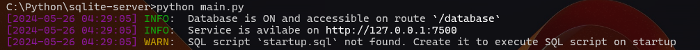

# SQLite-server
Async HTTP server for SQLite using [aiosqlite](https://pypi.org/project/aiosqlite/) and [FastAPI](https://fastapi.tiangolo.com/).

## Details
**SQLite-server** it's a project to host SQLite database as an external web service using HTTP and websockets (in future).</br>
Using Python and FastAPI provides low backend latency and using of user defined function in SQL syntax.

You can define your own functions by adding it into `sqlfunctions.py` file.

## Installatioin and usage
### Installation:
- Download source code from this repository, unpack it into your work directory.
- Enable virtual environment if you need, otherwise just skip this step.
- Install all of the dependencies using `pip install -r requirements.txt` command.
- Modify `config.toml` settings as you need, you can see an example of config file lower.
```toml
# This is an examply of SQLite server config.
# Database will be acessible only from localhost by using `http://127.0.0.1:7500` route ans `pass` password.

[database]

# Database connections settings
route = "/database"
host = "127.0.0.1"
port = 7500

# Database security settings
allowed_passwords = ["pass"]  # No password required if allowed password list is empty
allowed_ips = ["127.0.0.1"]   # No IPs limits if allowed IPs list is empty
```
- Add `startup.sql` containing SQL code to execute every time server runs if you need, example file lower.
```sql
CREATE TABLE IF NOT EXISTS "Users" (
    "login" TEXT UNIQUE NOT NULL,
    "password" TEXT NOT NULL 
) STRICT;
```

### Usage:
#### Accessing database
After passing all of the installation steps you can execute `main.py` file.</br>
After server startup you will see this:


Now you can access database using `POST` requests to `HTTP://<host>:<port>/<path>`.</br>
Here is a Python script that adds user to database, if startup SQL script from example upper was executed.
```py
import requests
import json

# URL to database route
DATABASE_URL = "http://127.0.0.1:7500/database"

# Inserting some data to datbase
print("Executing insert query...")
requests.post(DATABASE_URL, json={
    "password": "pass",
    "query": "INSERT INTO Users (login, password) VALUES ('Zubenko Mikhail Petrovich', 'Mafioznik');",
    "single": True
})

# Another one insertion
print("Executing insert query...")
requests.post(DATABASE_URL, json={
    "password": "pass",
    "query": "INSERT INTO Users (login, password) VALUES ('TestUser', 'Password');",
    "single": True
})

# Selecting some data from database
print("Executing select query...")
select_response = requests.post(DATABASE_URL, json={
    "password": "pass",
    "query": "SELECT * FROM Users;",
    "single": True
})

print(json.dumps(select_response.json()["data"], indent=4))
```
After executing of this script you will see this:


> [!Important]  
> If you want to execute script and not just a single SQL query you have to set `single` to `False`.</br>
> You can't retrieve data from queries flaged with `single`, use it only for executing a lot of code or transactions.

#### User defined functions
`sqlfunction.py` contains some basic function that accessible directly from SQL syntax to make it easier.</br>
Here is categories of functions that file contains:
- Cryptographic functions
- String functions
- Time functions
- Python reflection functions

Functions list will be increasing with a repository updates.</br>
Example of usage some of the functions:
```py
import requests

# NOTE: As i said earlier - password param are not required if `allowed_passwords` list is empty at config

# URL to database route
DATABASE_URL = "http://127.0.0.1:7500/database"

# Getting current time stamp
now_timestamp = requests.post(DATABASE_URL, json={
    "query": "SELECT NOW_TIMEStAMP();",
    "single": True
}).json()["data"][0][0]

# Getting string MD5 hash
string_hash = requests.post(DATABASE_URL, json={
    "query": "SELECT MD5('Hello world!');",
    "single": True
}).json()["data"][0][0]

# Converting string to lowercase
lowered_string = requests.post(DATABASE_URL, json={
    "query": "SELECT TO_LOWER('HELLO WORLD!')",
    "single": True
}).json()["data"][0][0]

# Getting function documentation using Python reflection
function_documentation = requests.post(DATABASE_URL, json={
    "query": "SELECT FUNCTION_DOCUMENTATION('SHA256')",
    "single": True
}).json()["data"][0][0]


print("now timestamp:", now_timestamp)
print("String md5:", string_hash)
print("Lowered string:", lowered_string)
print("SHA256 function documentation:", function_documentation)
```
After executing of this script you will see this: 


> [!Tip]  
> You can also use user defined function in `startup.sql` script.</br>
> It's can be useful in triggers.
> ```sql
> CREATE TRIGGER IF NOT EXISTS "UsersInsertionTrigger"
> AFTER INSERT ON "Users"
> BEGIN
>     UPDATE "password" SET "password" = SHA256("password");
> END;
> ```

## TODO
- [ ] Make more user friendly logs messages
- [ ] Add max request count limit per minutes / seconds per IPs
- [ ] Add websocket support
